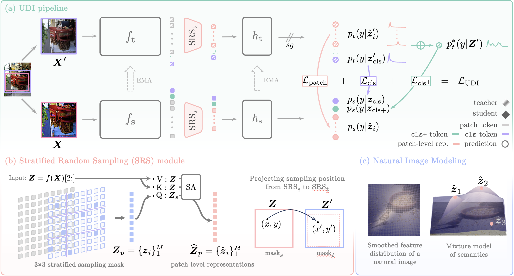
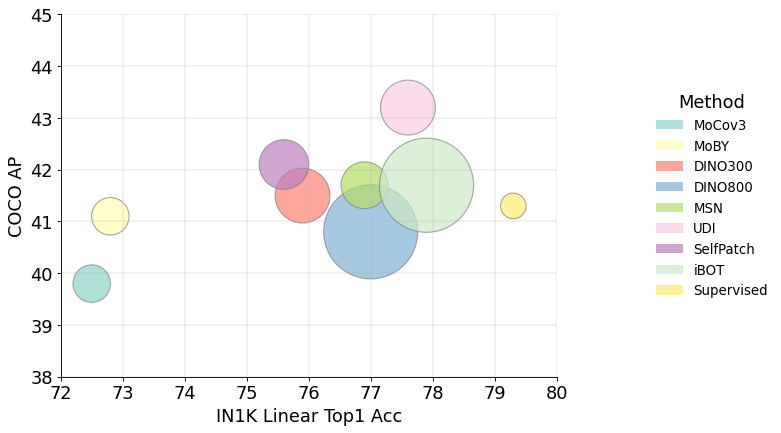
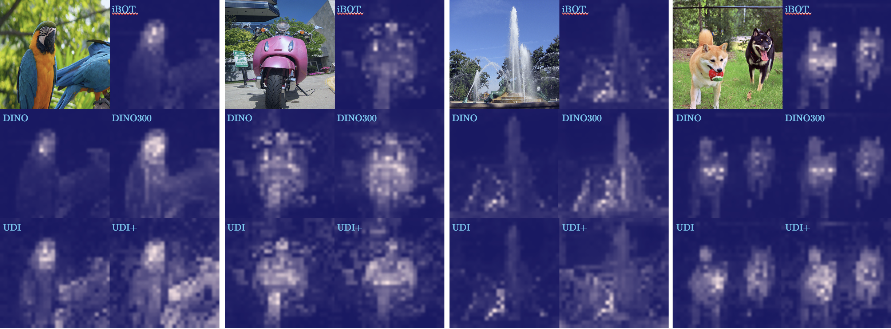

# Unsqueeze [] Bottleneck to Learn Rich Representations

This is the official PyTorch implementation of **UDI** proposed in our paper, "_Unsqueeze \[CLS\] bottleneck to Learn Rich Representations_", available at: [](http://arxiv.org/abs/2407.17671)
[](https://www.ecva.net/papers/eccv_2024/papers_ECCV/html/5810_ECCV_2024_paper.php)


 <br />
<div align="center">

</div>

<p align="left"> <b>Fig. 1 UDI Framework</b>. UDI is an SSL method based on the joint-embedding strategy with multilevel self-distillation objectives. Specifically, for each image, UDI creates two views with one cropped out from the other, followed by two random augmentations, respectively, for student network $h_\text{s}\circ\text{SRS}_\text{s}\circ f_{\text{s}}$ and teacher network  $h_\text{t}\circ\text{SRS}_\text{t}\circ f_{\text{t}}$. UDI employs ViT with an extra class token $\boldsymbol{z}_{\texttt{cls}+}$ for encoder $f$. The dense features from $f$ are then sampled and processed by a Stratified Random Sampling (SRS) module to produce patch-level representations $\widehat{\boldsymbol{Z}}_p$. The class token $\boldsymbol{z}_{\texttt{cls}+}$ is learned to produce multimodal prediction against a target distribution $p^*_t({y}|\boldsymbol{Z}')$ constructed with patch-level predictions ${p}_t(y|\hat{\boldsymbol{z}}')$ and image-level prediction $p_t(y|\boldsymbol{z}'_{\text{cls}})$. The final UDI objective involves maximizing the agreement via cross-entropy loss between (i) $p_t(y|\boldsymbol{z}'_\text{cls})$, $p_s(y|\boldsymbol{z}_{\text{cls}})$, (ii) $p^*_t(y|\boldsymbol{Z}')$, $p_s(y|\boldsymbol{z}_{\text{cls}+})$, and (iii) ${p}_t(y|\hat{\boldsymbol{z}}'_i)$, ${p}_s(y|\hat{\boldsymbol{z}}_i)$, respectively.</p>


# Pretrained models on ImageNet-1K

We provide pretrained backbone and full checkpoints containing weights of backbone, prediction head and other modules for both student and teacher networks.
<table>
  <tr>
    <th>arch</th>
    <th>params</th>
    <th>pretraining epochs</th>
    <th>k-nn</th>
    <th>linear</th>
    <th colspan="6">download</th>
  </tr>
  <tr>
    <td>ViT-S/16</td>
    <td>21M</td>
    <td>100</td>
    <td>74.9%</td>
    <td>76.3%</td>
    <td><a href="https://drive.google.com/file/d/1KSHTd8XwYRfS1_bktD-eTdmBYk0vke9o/view?usp=sharing">backbone only</a></td>
    <td><a href="https://drive.google.com/file/d/19jkjQV-jRj-UBY7A0k7nCxDdaetx3SCI/view?usp=sharing">full ckpt</a></td>
    <td><a href="https://drive.google.com/file/d/1Z7ckP8NlbnG-nJCFMw4FloTNYFDAHXYu/view?usp=sharing">args</a></td>
    <td><a href="https://drive.google.com/file/d/1Z7ckP8NlbnG-nJCFMw4FloTNYFDAHXYu/view?usp=sharing">logs</a></td>
  </tr>
  <tr>
    <td>ViT-S/16</td>
    <td>21M</td>
    <td>300</td>
    <td>75.6%</td>
    <td>77.6%</td>
    <td><a href="https://drive.google.com/file/d/1bsUuHCkq59OkJAANuAaQqmr_YKeOxja9/view?usp=sharing">backbone only</a></td>
    <td><a href="https://drive.google.com/file/d/1Cubki2_bhLRqBX_EMsE6GGScELG6u9_4/view?usp=sharing">full ckpt</a></td>
    <td><a href="https://drive.google.com/file/d/1KlE-viIQfFBy5pV4xCVAv8o4JEc5U7fX/view?usp=sharing">args</a></td>
    <td><a href="https://drive.google.com/file/d/1HSG4gUF35Pg3po9CerU5KF3gAhZ9cQjL/view?usp=sharing">logs</a></td>
  </tr>
</table>
<p align="center"><b>Table 1.</b> KNN and linear probing performance with their corresponding hyper-parameters, logs and model weights.</p>
 
 <br />

<div align="center">
  
</div>

<p align="left"><b>Fig 2.</b> Model Performance of Top1-Acc on IN-1K and mAP on MC-COCO. UDI achieves more balanced performance between the Image-level and dense prediction tasks.</p>

## Pretraining Settings 

### Environment :earth_africa:
For reproducing, please install [PyTorch](https://pytorch.org/) and download the [ImageNet](https://imagenet.stanford.edu/) dataset.
This codebase has been developed with python version 3.9, PyTorch version 1.12.1, CUDA 11.6 and torchvision 0.13.1. For the full 
environment, please refer to `requirement.txt` file. 


### ViT pretraining :bullettrain_front:
To pretraining with UDI, please find the exact hyper-parameter settings at the `args` column of  [Table 1](https://github.com/ISL-CV/udi). To run ViT-small, we use one node of total 8 A100 GPUs (total 1024 minibatch size) by using following command: 

**\[300 epoch\]**
```
torchrun --standalone --nproc_per_node=8 main_udi.py \
    --data_path $DATASET_ROOT \
    --output_dir $OUTPUT_ROOT \
    --arch vit_small \
    --teacher_temp 0.07 \
    --warmup_teacher_temp_epochs 30 \
    --warmup_epochs 10 \
    --local_crops_number 10 \
    --norm_last_layer false \
    --epochs 300
```

```diff

! **ViT-Small trained with 800 epoch and larger models (ViT-B, ViT-L) will be released in the future.**

```

## Evaluation: k-NN classification on ImageNet
To evaluate a simple k-NN classifier with a **single** GPU on a pre-trained model, run:
```
torchrun --standalone --nproc_per_node=$NPROC_PER_NODE ./eval_knn/eval_knn.py \
    --data_path $DATASET_ROOT \
    --pretrained_weights $PRETRAINED_WEIGHTS \
    --arch vit_small \
    --batch_size_per_gpu 256
```

## Evaluation: Linear classification on ImageNet
To train a supervised linear classifier on frozen weights on a single node with 8 gpus, run:
```
torchrun --standalone --nproc_per_node=$NPROC_PER_NODE ./eval_linear_probing/eval_linear.py \
    --data_path $DATASET_ROOT \
    --pretrained_weights $PRETRAINED_WEIGHTS \
    --arch vit_small \
    --lr 0.02 \
    --epochs 100
```

## Evaluation: Fine-tuning classification on ImageNet-1K
To evaluate fine-tuning on a pre-trained model, you need to
#### 1. convert the model weight to the required form 
```
python ./eval_finetuning/extract_backbone_weights_for_finetuning.py \
    --checkpoint $CHECKPOINT \
    --output $OUTPUT \
    --checkpoint_key teacher
```
#### 2. fine-tune the model
```
torchrun --standalone --nproc_per_node=4 ./eval_finetuning/eval_finetuning.py --data_path $DATASET_ROOT --finetune $OUTPUT \ 
    --model vit_small --epochs 200 --batch_size 256 --warmup_epochs 20 --drop_path 0.1 --lr 0.001 --layer_decay 0.55 \
    --mixup 0.8 --cutmix 1.0 --layer_scale_init_value 0.0 \
    --disable_rel_pos_bias --abs_pos_emb --use_cls --imagenet_default_mean_and_std
```


#### **For details of other evaluations, please refer to the `README.md` files in corresponding folders**


## Self-attention visualization
To visualize the self-attention map of the [CLS] token on the heads of the last layer, run
```
python visualize_attention.py  --pretrained_weights ${dir_to_model}
```
<div align="center">
  
</div>

<p align="center"><b>Fig 3.</b> Self-attention of ViT-Small/16 trained with UDI.</p>


## License
This repository is released under the Apache 2.0 license as found in the [LICENSE](LICENSE) file.

## Citation
If you find this repository useful, please consider giving a star :star: and citation :blue_book::
```
@inproceedings{udi2024ssl,
  title={Unsqueeze [CLS] bottleneck to Learn Rich Representations},
  author={Qing Su and Shihao Ji},
  booktitle={The 18th European Conference on Computer Vision (ECCV)},
  year={2024}
}
```

## Acknowledgement

```
This software was created by Georgia State University Research Foundation under Army Research Laboratory (ARL) Award Number W911NF-23-2-0224. ARL, as the Federal awarding agency, reserves a royalty-free, nonexclusive and irrevocable right to reproduce, publish, or otherwise use this software for Federal purposes, and to authorize others to do so in accordance with 2 CFR 200.315(b).
```
